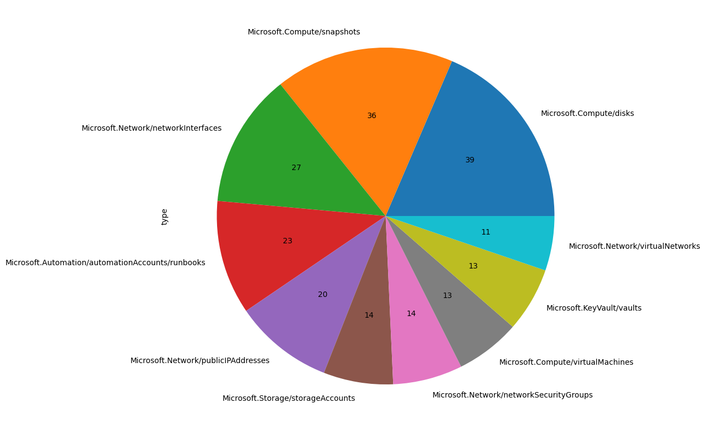

# How to use the Azure SDK for Python to retrieve a list of Azure Resources

## Introduction

The [Azure SDK for Python](https://learn.microsoft.com/en-us/azure/developer/python/sdk/azure-sdk-overview) [1] is one of many ways to connect to Azure REST APIs and extract information. Here is an example on how to retrieve all resources from an Azure subscription, put the data into a [Pandas DataFrame](https://pandas.pydata.org/pandas-docs/stable/reference/api/pandas.DataFrame.html) [2] and plot a simple pie chart using [matplotlib](https://matplotlib.org/) [3].

### Import Libraries

We need to import the following libraries.

```python
# Import libraries
from azure.identity import AzureCliCredential
from azure.mgmt.resource import ResourceManagementClient
import pandas as pd
import matplotlib
```

### Acquire Credentials and obtain the Management Object

When using `AzureCliCredential()`, Python will use the Azure CLI context of the currently logged-in user for executing the queries.

```python
# Acquire credential
credential = AzureCliCredential()

# Define Scope
subscription_id = "subscription_id"

# Obtain the management object for resources.
resource_client = ResourceManagementClient(credential, subscription_id)
```

### Create and Populate a Dictionary

Using `resource_client.resources.list()` through the resource client will retrieve an interable object with all Azure resources in the given subscription. We can now populate a Python dictionary with the resources and add them to a Pandas DataFrame.

```python
resources = resource_client.resources.list()
dict = []
for resource in resources:
    dict.append(resource.as_dict())
```

### Create a DataFrame from the Dictionary

```python
df = pd.DataFrame.from_dict(dict)
```

### Select only the Top 10 rows based on the Resource Type Count

```python
type_df = df['type'].value_counts()
type_df_top = type_df.head(10)
```

### Finally plot the Pie Chart

```python
plot = type_df_top.plot.pie(figsize=(10, 10), autopct= lambda x: '{:.0f}'.format(x*type_df_top.sum()/100))
```

... which might look like something along these lines.


## Summary

This short article has scratched the surface on what is possible when using the Azure SDK for Python since it allows as to combine the power of Python with the capabilities of the Azure REST API.
We have extracted a list of Azure resources based on a given context, added them to a Pandas DataFrame and plotted a simple pie chart based on the top 10 resource count.

## References

| # | Title | URL |
| --- | --- | --- |
| 1 | Use the Azure libraries (SDK) for Python | https://learn.microsoft.com/en-us/azure/developer/python/sdk/azure-sdk-overview |
| 2 | pandas.DataFrame | https://pandas.pydata.org/pandas-docs/stable/reference/api/pandas.DataFrame.html |
| 3 | Matplotlib: Visualization with Python | https://matplotlib.org/ |
