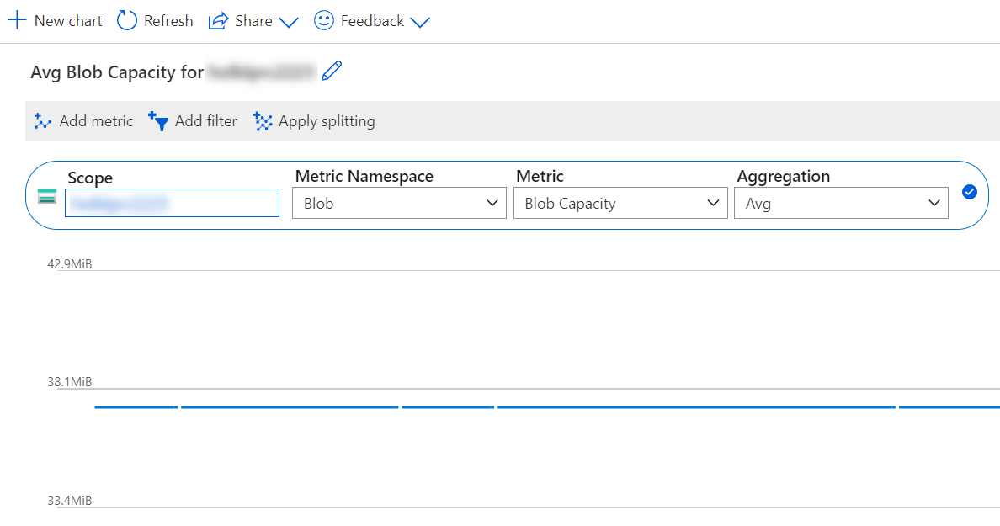

## Retrieve Azure Storage Account Metrics

When using the Azure Portal, it is relatively straightforward to view basic Storage Account Metrics, such as the overall capacity but also blob or files capacity or queue transactions.

This information can alsp be queried through [Azure Monitor REST API](https://learn.microsoft.com/en-us/rest/api/monitor/metrics/list) or the [Azure SDK for Python](https://learn.microsoft.com/en-us/azure/developer/python/sdk/azure-sdk-overview). This might make sense if metrics need to be queried at scale against a larger population of storage accounts.

Below is an example for retrieving this information using the Azure SDK for Python. It is basically a function that queries the current storage capacity (based on metric values from the last 4 hours) as well as the transaction count for Queues and Tables for the last 30 days. The timeframe can be modified relatively easy. It might make more sense to pass the desired timeframe into the function though - however, for a first try and testing whether the data can be queried successfully, the below code might work. 

```python
from azure.identity import AzureCliCredential
from azure.mgmt.monitor import MonitorManagementClient
import datetime
import json

def get_storage_account_metrics(storage_account_id, subscription_id, credential):
    storage_blob_resource_id = storage_account_id + '/blobServices/default'
    storage_files_resource_id = storage_account_id + '/fileServices/default'
    storage_queue_resource_id = storage_account_id + '/queueServices/default'
    storage_table_resource_id = storage_account_id + '/tableServices/default'

    monitor_client = MonitorManagementClient(
        credential = credential,
        subscription_id = subscription_id
    )

    blob_capacity = monitor_client.metrics.list(
        storage_blob_resource_id,
        timespan="{}/{}".format(datetime.datetime.now() - datetime.timedelta(hours=4), datetime.datetime.now()),
        interval='PT1H',
        metricnames='BlobCapacity',
        aggregation='Average'
    )

    for b_value in blob_capacity.value:
        for timestamp in b_value.timeseries:
            for datapoint in timestamp.data:
                if type(datapoint.average) == float:
                    blob_capacity_average = datapoint.average

    blob_capacity_result = dict({
        'unit': b_value.unit,
        'quantity': blob_capacity_average
    })

    file_capacity = monitor_client.metrics.list(
        storage_files_resource_id,
        timespan="{}/{}".format(datetime.datetime.now() - datetime.timedelta(hours=4), datetime.datetime.now()),
        interval='PT1H',
        metricnames='FileCapacity',
        aggregation='Average'
    )

    for f_value in file_capacity.value:
        for timestamp in f_value.timeseries:
            for datapoint in timestamp.data:
                if type(datapoint.average) == float:
                    file_capacity_average = datapoint.average

    file_capacity_result = dict({
        'unit': f_value.unit,
        'quantity': file_capacity_average
    })

    queue_capacity = monitor_client.metrics.list(
        storage_queue_resource_id,
        timespan="{}/{}".format(datetime.datetime.now() - datetime.timedelta(hours=4), datetime.datetime.now()),
        interval='PT1H',
        metricnames='QueueCapacity',
        aggregation='Average'
    )

    for q_value in queue_capacity.value:
        for timestamp in q_value.timeseries:
            for datapoint in timestamp.data:
                if type(datapoint.average) == float:
                    queue_capacity_average = datapoint.average

    queue_capacity_result = dict({
        'unit': q_value.unit,
        'quantity': queue_capacity_average
    })

    queue_transactions = monitor_client.metrics.list(
        storage_queue_resource_id,
        timespan="{}/{}".format(datetime.datetime.now() - datetime.timedelta(days=30), datetime.datetime.now()),
        interval='PT1H',
        metricnames='Transactions',
        aggregation='Total'
    )

    queue_transactions_total = float(0)

    for value in queue_transactions.value:
        for timestamp in value.timeseries:
            for datapoint in timestamp.data:
                if type(datapoint.total) == float:
                    queue_transactions_total += datapoint.total

    queue_transactions_result = dict({
        'unit': value.unit,
        'quantity': queue_transactions_total
    })

    table_capacity = monitor_client.metrics.list(
        storage_table_resource_id,
        timespan="{}/{}".format(datetime.datetime.now() - datetime.timedelta(hours=4), datetime.datetime.now()),
        interval='PT1H',
        metricnames='TableCapacity',
        aggregation='Average'
    )

    for value in table_capacity.value:
        for timestamp in value.timeseries:
            for datapoint in timestamp.data:
                if type(datapoint.average) == float:
                    table_capacity_average = datapoint.average

    table_capacity_result = dict({
        'unit': value.unit,
        'quantity': table_capacity_average
    })

    table_transactions = monitor_client.metrics.list(
        storage_table_resource_id,
        timespan="{}/{}".format(datetime.datetime.now() - datetime.timedelta(days=30), datetime.datetime.now()),
        interval='PT1H',
        metricnames='Transactions',
        aggregation='Total'
    )

    table_transactions_total = float(0)

    for value in table_transactions.value:
        for timestamp in value.timeseries:
            for datapoint in timestamp.data:
                if type(datapoint.total) == float:
                    table_transactions_total += datapoint.total

    table_transactions_result = dict({
        'unit': value.unit,
        'quantity': table_transactions_total
    })


    storage_metrics_result = dict({
        'blob': blob_capacity_result,
        'files': file_capacity_result,
        'queue_capacity': queue_capacity_result,
        'queue_transactions': queue_transactions_result,
        'table_capacity': table_capacity_result,
        'table_transactions': table_transactions_result
    })

    return storage_metrics_result
```

Now, to test the function and return the results in json format, it can be executed like this:

```python
credential = AzureCliCredential()

storage_account_resource_id = '/subscriptions/{subscription_id}/resourceGroups/{resource_group_name}/providers/Microsoft.Storage/storageAccounts/{storage_account_name}'

subscription_id = '{subscription_id}'

metrics = get_storage_account_metrics(storage_account_id=storage_account_resource_id, credential=credential, subscription_id=subscription_id)

print(json.dumps(metrics))
```

The result should be something along the lines below:

```bash
$ python3 get-metrics.py | jq

{
  "blob": {
    "unit": "Bytes",
    "quantity": 199999297201
  },
  "files": {
    "unit": "Bytes",
    "quantity": 1194018597031
  },
  "queue_capacity": {
    "unit": "Bytes",
    "quantity": 0
  },
  "queue_transactions": {
    "unit": "Count",
    "quantity": 0
  },
  "table_capacity": {
    "unit": "Bytes",
    "quantity": 8336906
  },
  "table_transactions": {
    "unit": "Count",
    "quantity": 4271
  }
}

```

There are various possibilities for further use. One could run this against a list of storage accounts (i.e. query all accounts through Azure Resource Graph) and then loop through all accounts; export the data into a Pandas DataFrame for further processing; etc. For example:

```python
import pandas as pd

results = []

for storage_account_resource_id in storage_account_resource_ids:
    metrics = get_storage_account_metrics(storage_account_id=storage_account_resource_id, credential=credential, subscription_id=subscription_id)
    metrics_dict = dict({
        'subscription_id': subscription_id,
        'storage_account_resource_id': storage_account_resource_id,
        'blob_unit': metrics.get('blob').get('unit'),
        'blob_quantity': metrics.get('blob').get('quantity'),
        'files_unit': metrics.get('files').get('unit'),
        'files_quantity': metrics.get('files').get('quantity'),
    })
    results.append(metrics_dict)

print(pd.DataFrame(results))
```

...which would result in something like this:

```bash
$ python3 get-metrics.py
                        subscription_id                        storage_account_resource_id blob_unit  blob_quantity files_unit  files_quantity
0                     {subscription_id}                /subscriptions/{subscription_id}...     Bytes   2.072325e+11      Bytes    1.194019e+12
1                     {subscription_id}                /subscriptions/{subscription_id}...     Bytes   3.479000e+03      Bytes    0.000000e+00
```

## References

| # | Title | URL |
| --- | --- | --- |
| 1 | Azure Monitor REST API | https://learn.microsoft.com/en-us/rest/api/monitor/metrics/list |
| 2 | Azure SDK for Python | https://learn.microsoft.com/en-us/azure/developer/python/sdk/azure-sdk-overview |
