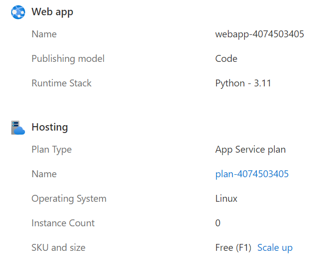
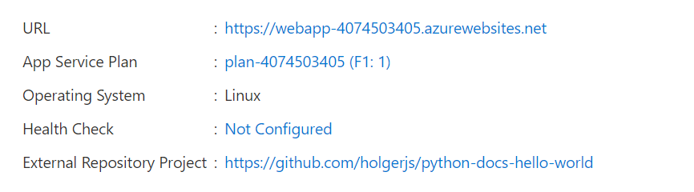
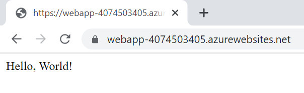

## Azure SDK for Python: How to create a Python Azure Web App

> **Warning**
> 
> Information, configurations and code contained in this repository is solely intended for testing and learning and must _not_ be used in production environments. Any resource and configuration that was created during testing should be removed once testing is finished in order to avoid potentially significant consumption costs.

### Introduction

Here is a quick tutorial on how to create a Python 3.11 Web App and deploy code directly from a GitHub repository.

In order to be able to deploy an App Service Plan and the corresponding Web App, I installed and imported two libraries:

- [`azure-identity`](https://pypi.org/project/azure-identity/) [1]
- [`azure-mgmt-web`](https://pypi.org/project/azure-mgmt-web/) [2]

#### Installation through PIP

```bash
pip install azure-identity
pip install azure-mgmt-web
```

#### Import Libraries

Since I'm using the AzureCLI for authentication anyways, I'm importing `AzureCliCredential` from the `azure-identity` library. This is just my personal preference for testing. Other classes from that library would work as well. From `azure-mgmt-web`, we'd need the `WebSiteManagementClient` as well as multiple models for creating the App Service Plan and Web App configuration.

```python
from azure.identity import AzureCliCredential
from azure.mgmt.web import WebSiteManagementClient
from azure.mgmt.web.models import AppServicePlan, SkuDescription, Site, SiteConfig, SiteSourceControl
```

The following two libraries are not required for functionality but they help during testing. I'm using `uuid` to generate a unique (well, not 100%ish) name and `json` to prettify the output a little bit:

```python
import uuid
import json
```

### Create the App Service Plan

First of all I'm creating a random, unique number and provide subscription and resource group details.

```python
# Create a random number
unique_deployment_number = str(uuid.uuid4().time_low)

# Provide Subscription / Resource Group details
my_subscription_id = '{subscription-id}'
my_resource_group_name = '{resource-group-name}'
```

Secondly, I need to authenticate to Azure and create the appropriate client:

```python
# Authenticate to Azure and create client
my_credential = AzureCliCredential()
webapp_client = WebSiteManagementClient(credential=my_credential, subscription_id=my_subscription_id)
```

Then, I'm creating a _Linux_ App Service Plan. This requires some specific settings, such as:

- the App Service Plan _name_, for which I'm just using the term 'plan' and add aforementioned unique number to it.
- the Azure _location_, where the Plan should be created (I'm using `westeurope` for testing, as this region usually has all the SKUs available)
- the Azure _Resource Group_ into which the Plan should be deployed
- the Plan _type_, which must be `linux` since I want to create a Python Web App
- it must be `reserved` as that is required for `linux` App Service Plans
- the _SKU_ details, which determine the costs of the App Service Plan (I'm using the free tier in order to avoid high costs during testing)

```python
# Create the App Service Plan
create_plan = webapp_client.app_service_plans.begin_create_or_update(
    name = 'plan-'+unique_deployment_number,
    resource_group_name = my_resource_group_name,
    app_service_plan = AppServicePlan(
        location = 'westeurope',
        kind = 'linux',
        reserved = True,
        sku = SkuDescription(
            name = 'F1',
            capacity = 1,
            tier = 'Free'
        )
    )
)
```

Lastly, I use the `json` library to put the results out to the console.

```python
# Output of the results as JSON
print(json.dumps(create_plan.result().as_dict(), sort_keys=True, indent=2))
```

Result:

```json
{
  "elastic_scale_enabled": false,
  "geo_region": "West Europe",
  "hyper_v": false,
  "id": "/subscriptions/{subscription-id}/resourceGroups/{resource-group-name}/providers/Microsoft.Web/serverfarms/plan-4074503405",
  "is_spot": false,
  "is_xenon": false,
  "kind": "linux",
  "location": "westeurope",
  "maximum_elastic_worker_count": 1,
  "maximum_number_of_workers": 0,
  "name": "plan-4074503405",
  "number_of_sites": 0,
  "number_of_workers": 1,
  "per_site_scaling": false,
  "provisioning_state": "Succeeded",
  "reserved": true,
  "resource_group": "{resource-group-name}",
  "sku": {
    "capacity": 1,
    "family": "U",
    "name": "U13",
    "size": "U13",
    "tier": "LinuxFree"
  },
  "status": "Ready",
  "subscription": "{subscription-id}",
  "target_worker_count": 0,
  "target_worker_size_id": 0,
  "type": "Microsoft.Web/serverfarms",
  "zone_redundant": false
}
```

The [sample script for creating an app service plan can be seen here](scripts/create_azure_app_service_plan.py).

### Create the Web App

Next, I needed to create the web app on top of the newly created plan.

As first step, I was getting the App Service Plan Id.

```python
try:
    app_service_plan = webapp_client.app_service_plans.get(
        name = 'plan-'+unique_deployment_number,
        resource_group_name = my_resource_group_name
    )
except Exception:
    print(f'Error: App Service Plan {my_app_service_plan_name} not found.')
```

Secondly, I checked whether the name that I wanted to use for my web app was already in use or not (similar to the plan name I just built it from the same random number):

```python
availability_check = webapp_client.check_name_availability(
    name = 'webapp-'+unique_deployment_number,
    type = 'Microsoft.Web/sites'
)
```

And then finally, I was able to deploy the Web App. Note that both site configurations _must_ be in place for the Web App to be properly created as Python App:
- `python_version`
- `linux_fx_version`

```python
if availability_check.name_available == True:
    create_website = webapp_client.web_apps.begin_create_or_update(
        name = 'webapp-'+unique_deployment_number,
        resource_group_name = my_resource_group_name,
        site_envelope = Site(
            location = 'westeurope',
            server_farm_id = app_service_plan.id,
            site_config = SiteConfig(
                python_version = '3.11',
                linux_fx_version = 'PYTHON|3.11'
            )
        )
    )
    # Output of the results as JSON
    print(json.dumps(create_website.result().as_dict(), sort_keys=True, indent=2))
else:
    print(f'Error: Name {my_webapp_name} is already in use.')
```

Since the name was not in use yet, the output was confirming the successful creation of the web app:

```JSON
{
  "availability_state": "Normal",
  "client_affinity_enabled": true,
  "client_cert_enabled": false,
  "client_cert_mode": "Required",
  "container_size": 0,
  "custom_domain_verification_id": "{redacted}",
  "daily_memory_time_quota": 0,
  "default_host_name": "webapp-4074503405.azurewebsites.net",
  "enabled": true,
  "enabled_host_names": [
    "webapp-4074503405.azurewebsites.net",
    "webapp-4074503405.scm.azurewebsites.net"
  ],
  "host_name_ssl_states": [
    {
      "host_type": "Standard",
      "name": "webapp-4074503405.azurewebsites.net",
      "ssl_state": "Disabled"
    },
    {
      "host_type": "Repository",
      "name": "webapp-4074503405.scm.azurewebsites.net",
      "ssl_state": "Disabled"
    }
  ],
  "host_names": [
    "webapp-4074503405.azurewebsites.net"
  ],
  "host_names_disabled": false,
  "https_only": false,
  "hyper_v": false,
  "id": "/subscriptions/{subscription-id]/resourceGroups/{resource-group-name]/providers/Microsoft.Web/sites/webapp-4074503405",
  "is_xenon": false,
  "key_vault_reference_identity": "SystemAssigned",
  "kind": "app,linux",
  "last_modified_time_utc": "2023-01-24T13:46:54.056666Z",
  "location": "westeurope",
  "name": "webapp-4074503405",
  "outbound_ip_addresses": "{redacted}",
  "possible_outbound_ip_addresses": "{redacted}",
  "redundancy_mode": "None",
  "repository_site_name": "webapp-4074503405",
  "reserved": true,
  "resource_group": "{resource-group-name]",
  "scm_site_also_stopped": false,
  "server_farm_id": "/subscriptions/{subscription-id]/resourceGroups/{resource-group-name]/providers/Microsoft.Web/serverfarms/plan-4074503405",
  "site_config": {
    "acr_use_managed_identity_creds": false,
    "always_on": false,
    "http20_enabled": false,
    "ip_security_restrictions": [
      {
        "action": "Allow",
        "description": "Allow all access",
        "ip_address": "Any",
        "name": "Allow all",
        "priority": 2147483647
      }
    ],
    "linux_fx_version": "",
    "minimum_elastic_instance_count": 0,
    "number_of_workers": 1,
    "scm_ip_security_restrictions": [
      {
        "action": "Allow",
        "description": "Allow all access",
        "ip_address": "Any",
        "name": "Allow all",
        "priority": 2147483647
      }
    ]
  },
  "state": "Running",
  "storage_account_required": false,
  "type": "Microsoft.Web/sites",
  "usage_state": "Normal",
  "vnet_content_share_enabled": false,
  "vnet_image_pull_enabled": false,
  "vnet_route_all_enabled": false
}
```

A check at the Web App in the Azure Portal confirms the successful deployment.



The [isolated code for creating a Web App can be seen here](scripts/create_azure_webapp.py).

### Deploy Code from GitHub

As last step, I wanted to deploy sample code from GitHub into the newly created Web App. Since this is more about the process of creating the infrastructure and deploying he app and not about the app itself, I have simply forked this [hello-world sample app](https://github.com/Azure-Samples/python-docs-hello-world) [3] from the [Azure Samples](https://github.com/Azure-Samples) GitHub repository [4] for testing the deployment.

Since I do not want to use continuous integration but rather do a one-off deployment, I'm using `is_manual_integration = True`.

```python
source_control = webapp_client.web_apps.begin_create_or_update_source_control(
    resource_group_name = my_resource_group_name,
    name = 'webapp-'+unique_deployment_number,
    site_source_control = SiteSourceControl(
        is_manual_integration = True,
        repo_url = 'https://github.com/{repository-url}',
        branch = 'master'
    )
)
```

In a proper script, I could now check the status through the `source_control.status()` variable for it to become `'Succeeded'`. Once the deployment is done, the portal would reflect the `External Repository Project`:



Finally, I could cofirm the deployment by following the link to the Web App URL and see the corresponding `Hello, World!` message in the browser.



The [isolated code for deploying from GitHub can be seen here](scripts/create_deployment_from_github.py).

### Conclusions

I was able to use Python and the Azure SDK for Python for a step-by-step deployment of an App Service Plan, a Web App and a sample Python Flask application from a GitHub repository. I had some issues with creating the App Service Plan and the Web App with the correct settings for Python, which resulted in the following learnings:
- When creating an App Service Plan of kind `linux`, the parameter `reserved = True` must be set, otherwise the App Service Plan will show as `Windows` in the Azure Portal.
- When creating the Web App, both `python_version` and `linux_fx_version` must be set - otherwise the stack will not be configured for Python and App deployments would fail for me:
    ```python
            site_config = SiteConfig(
                python_version = '3.11',
                linux_fx_version = 'PYTHON|3.11'
            )
    ```
- The deployment from a GitHub repository was very straightforward.

### References

| # | Title | URL | Accessed-On |
| --- | --- | --- | --- |
| 1 | azure-identity 1.12.0 | https://pypi.org/project/azure-identity/ | 2023-01-24 |
| 2 | azure-mgmt-web 7.0.0 | https://pypi.org/project/azure-mgmt-web/ | 2023-01-24 |
| 3 | Python Flask sample for Azure App Service (Linux) | https://github.com/Azure-Samples/python-docs-hello-world | 2023-01-24 |
| 4 | Azure Samples | https://github.com/Azure-Samples | 2023-01-24 |
| 5 | Azure Web Apps libraries for Python | https://learn.microsoft.com/en-us/python/api/overview/azure/app-service?view=azure-python | 2023-01-24 |
